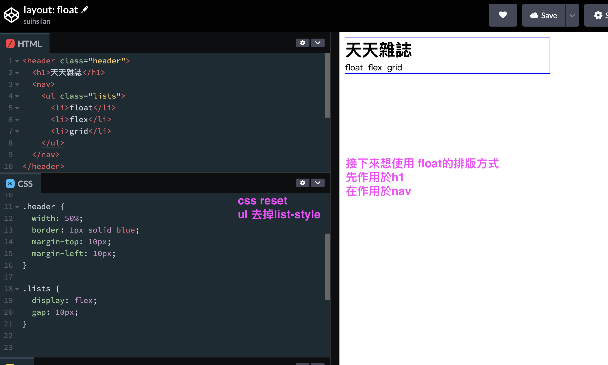

---
# SEO
title: floats 浮動元素
description: floats
# image: 在社交媒体卡片中显示的缩略图
keywords: [CSS, floats, 浮動]
sidebar_position: 2
---

# 認識 float 浮動

其實，CSS 我一直都沒有好好的整合觀念，所以很多觀念似懂又非懂，趁著閒暇時候，打算刷完整個 CSS 基礎課程

回歸正題： [我的 float 程式碼](https://codepen.io/suihsilan/pen/dywaBLQ)  
在還沒有 flex grid 等排版屬性出現時，古早是以 float 來做排版網頁元素，
當你想要在一個元素上宣告 float，
基本上只要在該元素 selector 寫上：

```css
float: left / right;
```

元素就會出現浮動版面了

## 到底什麼是 float 呢？

拿 codepen 舉例：  
假如今天我想要把下面這張圖片中的導覽列做一下排版


### h1 的 float: left;


h1 就會從原來的 header 容器中浮動出來，就好像不存在在頁面上一樣

h1 不再屬於 header container 中的子元素了，就是不受管理，

但是他還是會影響周遭的元素也跟『圍繞著 h1 浮動』

### nav 的 float: right;

我繼續在 nav 也添加浮動屬性


會發現 header 的容器因為其子元素都變成了浮動元素，缺乏內容而導致 height 塌陷，不過為什麼只剩下藍線呢？

這是因為原先我在.header 上所設置的 border，高度塌陷後，border 有上與下，就是現在在畫面上看到的藍線(border-top & border-bottom)

給容器加上 padding

也是會撐開高度

### 基礎版-float 造成的高度塌陷 collapsing height

由於上面實驗得知，將子元素都變成了浮動元素，容器會變成高度塌陷的狀況
那面對這樣以前的人都是如何利用 float 做處理的呢？

在容器的最後的子元素後面加上 div 標籤空的，專門用來清除浮動

## 加強版-clearfix::after 清除浮動＋偽元素的使用

不過一直給 html 加上空的 div 標籤來清除浮動也是很困擾，因此後來加強版就是搭配偽元素來使用::after


就是要在該容器內添加最後一個子元素::after(inline element)，並清除浮動

```css
.clearfix::after {
  clear: both;
  content: "";
  display: block;
}
```

這樣就完成啦！
現在要非常感謝有了 flex 和 grid 強大的排版屬性可以使用，但總是會遇到穿梭時光的專案，現在至少遇到 float 就不太會害怕了！

## float 和 position: absolute;有什麼不同？

兩者都是會脫離原來的排版流，但是 absolute 是一個特立獨行的狀態，他的自由是不影響其他元素，但 float 就是看似自由，但是他的影響是周遭元素會圍繞它而浮動。

absolute 會需要一個需要對準的父元素 container 定位(relative)，它的自由是由一個基準定位的

這裡又連接到了兩大重點：[偽元素, position]，我得要讓我的腦袋休息一下，再來去研究這兩篇的主題
