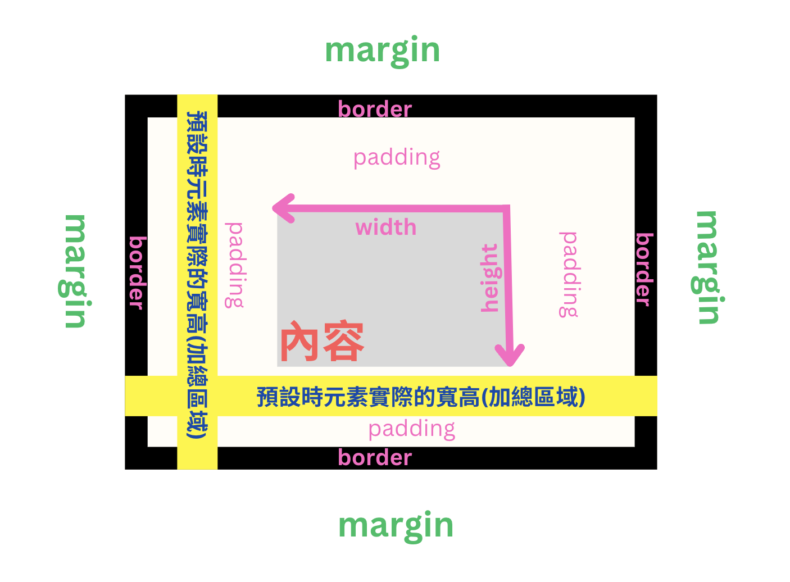
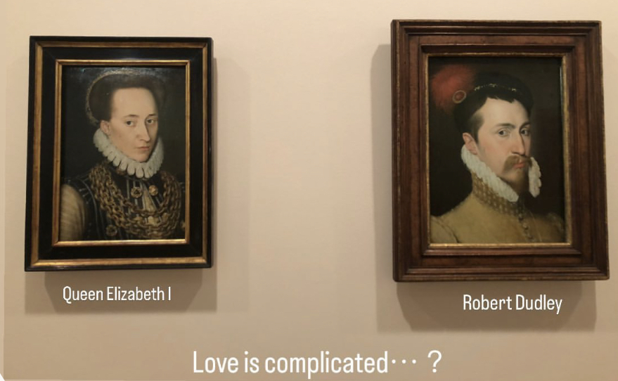
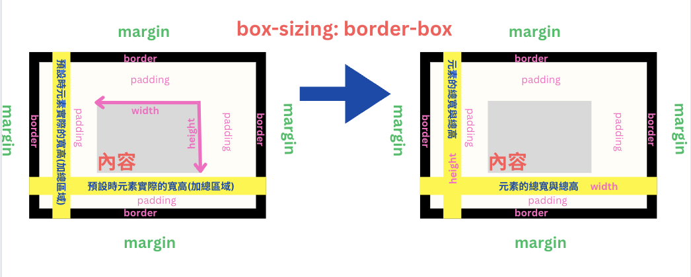

---
# SEO
title: CSS Box Model 盒模型
description: CSS Box Model 盒模型
# image: 在社交媒体卡片中显示的缩略图
keywords: [CSS, box model, 盒模型]
---

# 認識盒模型

你現在在這個螢幕上看到的文字、圖片等等這些被元素標籤框起來的都是盒模型，這是網頁如何顯示與呈現的一種規範，
盒模型就是網頁元素的基本結構。

## 網頁元素都是盒模型

用圖簡述一下盒模型的結構：

我們在元素標籤中寫入的都是內容，寬與高還可以再另外自己定義，那如果沒有定義就是會依據內容為主，再來可以設定 padding 與 border，這些值全部加總起來，是預設情況下的元素總寬與總高。

那麼外邊距是什麼呢？就是指元素與元素之間的距離，舉個例，之前剛好去墨爾本的 NGV 看展，以下是我曾經的貼文：

剛好我寫的標題好貼切：），以這張圖為例，外邊距 margin 就是元素與元素之間的距離
每一張畫都是元素呈現的話，那麼在陳列上我們當然也希望在展示畫作時，會有一種排版美感，
margin 外邊距就是這種『向外推擠的方式』

以這段愛情來說，這種畫作所陳列的 margin 剛好符合這段情感的結局=永恆的距離

## box-sizing 屬性

而當我們今天宣告 box-sizing：border-box;就是宣告將盒模型的總寬與總高預設的計算方式
直接定義成你所設定的寬與高的值都是已經包含了 padding 和 border，無需再擔憂計算的狀況～～

圖解：

