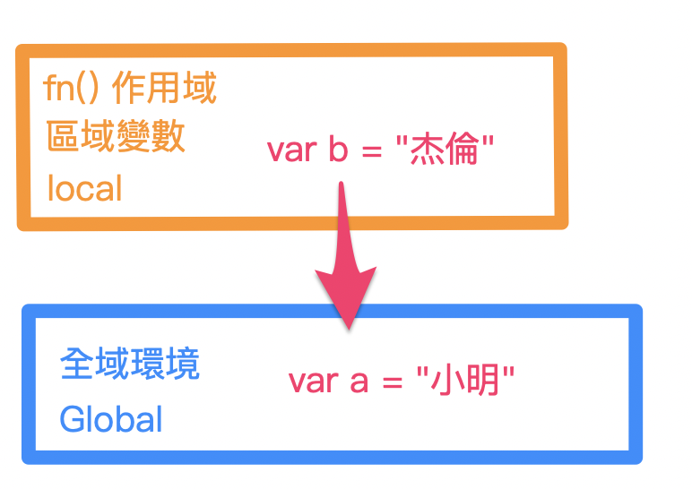
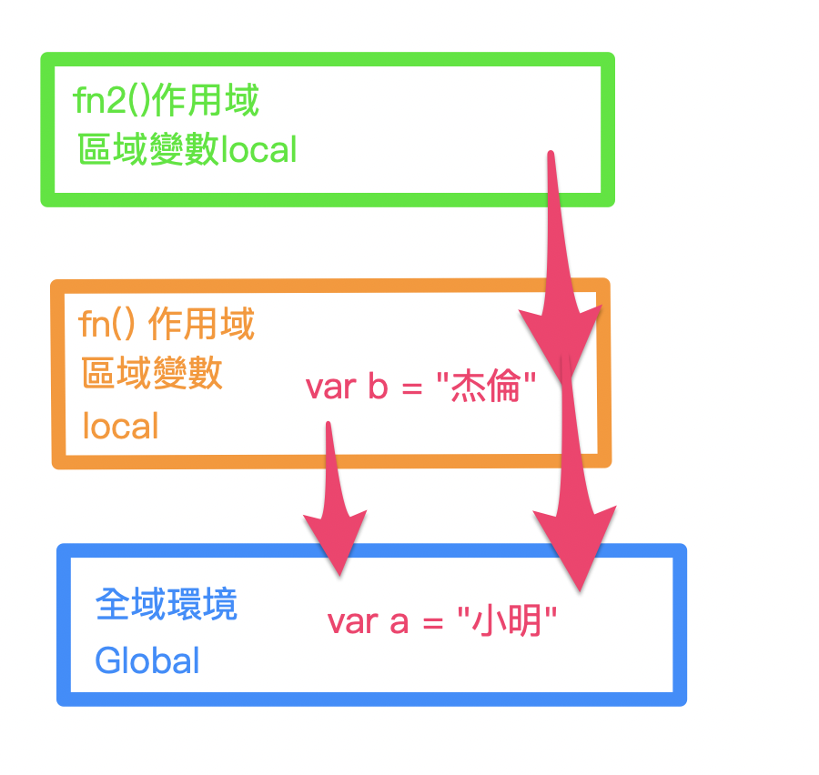
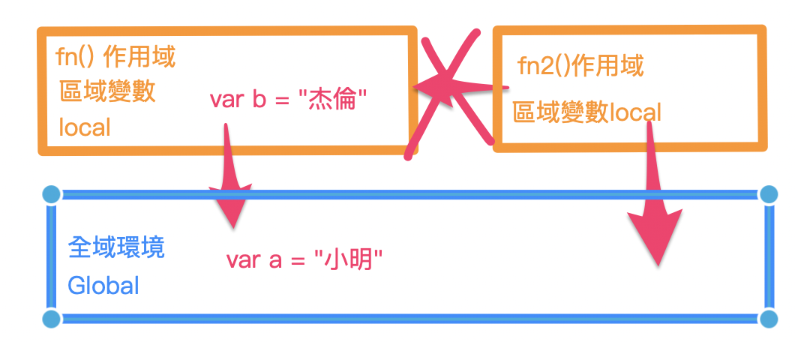
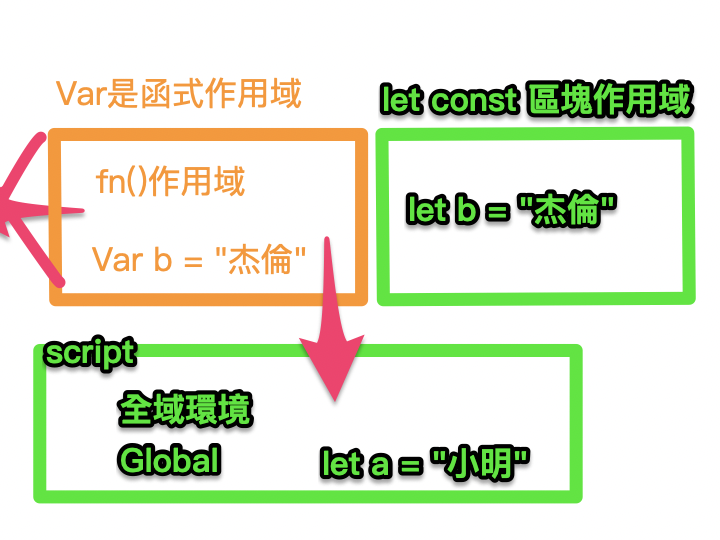
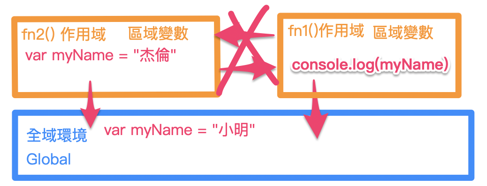
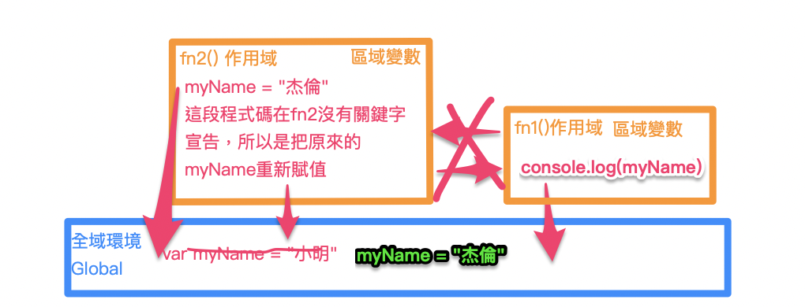

---
# SEO
title: 變數宣告與作用域
description: 變數宣告與作用域
# image: 在社交媒体卡片中显示的缩略图
keywords: [作用域, 變數宣告]
sidebar_position: 1
---

## 變數及屬性

### 例子 1： 請問 data 會不會有值？ 值為何?

這題 data 宣告，沒有寫上關鍵字：

```js
setTimeout(() => {
  data = [];
  updateData();
  console.log(data);
}, 0);

function updateData() {
  data.push(1);
}
```

會回傳：

```
 [1]
```

這題與『作用域』有關係

### 例子 2: 請問 data 的值為? (地獄級題目)

這題情況是 data 用 var 宣告：

```js
setTimeout(() => {
  var data = [];
  updateData();
  console.log(data);
}, 0);

function updateData() {
  data.push(1);
}
```

整個報錯：

```
"error"
"ReferenceError: data is not defined
    at updateData (tuhetonoca.js:8:5)
    at tuhetonoca.js:3:5"
```

### 例子 3：請問 console.log 的值為?

小明？杰倫？傻傻分不清楚：

```js
var myName = "小明";

function fn1() {
  console.log(myName);
}

function fn2() {
  var myName = "杰倫";
  fn1();
}

fn2();
```

會回傳：

```
“小明”
```

## var let cont 作用域有什麼差別？

```js
var a = "小明";
let b = "杰倫";
console.log(window); //全域物件
```

當我在 JS Bin 測試，展開 window 物件會發現用 var 宣告的 a 變數值“小明”，
會變成 window 全域物件之下的屬性之ㄧ；
但用 let 宣告的 b 變數則不會

不過兩者直接 console 變數都可以取到值，但從 window 中取值就有很大的差異：

```js
console.log(a, b); //小明 杰倫

console.log(window.a); //小明
console.log(window.b); //undefined
```

直接不用關鍵字宣告 c 變數：

```js
c = "帥哥哥";
console.log(window.c); //帥哥哥
```

結果會發現，c 變數沒有用關鍵字宣告，會成為了 window 物件下的屬性(而不是真正的變數)

目前為止，a b c 都是接近全域下的變數(c 沒有關鍵字宣告-> 全域屬性)

### 用 var 宣告一個物件 -> 『物件屬性可以被刪除』

接著我繼續宣告一個物件(一種集合)，物件有一個特性：『它的屬性可以被刪除』：

```js
var obj = {
  myName: "鯨魚",
};

console.log(obj.myName); //"鯨魚"

//若要刪除物件屬性的話：
delete obj.myName;

console.log(obj.myName); //undefined
```

### 再繼續回到 a b c 這三個變數來討論：當沒有關鍵字宣告變數時，該變數會淪為一個全域屬性

```js
var a = "小明"; //var宣告的全域變數＆同時也是window物件的屬性
let b = "杰倫"; //let宣告的變數 （不是window物件的屬性）
c = "帥哥哥"; //沒有關鍵字宣告-> 全域物件下的屬性 （window屬性）

console.log(c); //“帥哥哥”
```

window 物件下的屬性，不需要寫上 window，可以直接取值(如 c 和 a)

### 當沒有關鍵字宣告變數時，變數會淪為一個全域屬性，會發生什麼？

繼續接著刪除 window 物件的 a 與 c 屬性：

```js
delete window.a;
delete window.c;

console.log(window.a); //"小明"
console.log(window.c); //undefined －> 會發生『物件屬性可以被刪除』！
```

由此可知，由 var 關鍵字所宣告的 a 變數＆同時也是 window 的屬性，仍還在並沒有因為
刪除物件屬性這個特點而消失

但反觀沒有關鍵字宣告的 c，會直接成為 window 的屬性，而由於『物件屬性可以被刪除』這點而消失，
進而無法取值->undefined

小結：
a -> 變數(有關鍵字 var 宣告)<br/>
b -> 變數(有關鍵字 let 宣告)<br/>
c ->>window 全域下的屬性

## 作用域 scope

### 上層作用域可以存取下層作用域(全域環境/window 物件)的所有資源

以下例子以 var 做宣告變數-> var 函式作用域，我們所宣告的變數
會被限制在 function 裡

```js
var a = "小明";

function fn1() {
  var b = "杰倫";
  console.log(a, b);
  debugger; //可以終止函式執行，像是一個斷點，除錯工具
}

fn1();
```

這段程式碼會回傳：

```js
“小明”
“杰倫”
```

local -> 區域變數 <br/>
global-> 全域物件(window)



上層作用域可以存取下層作用域(全域環境/window 物件)的所有資源

### 嵌套函式的作用域

再將剛剛的程式碼嵌入另一段函式：

```js
var a = "小明"; //全域變數

function fn1() {
  var b = "杰倫"; //區域變數
  console.log(a, b);

  //在fn1中嵌入fn2
  function fn2() {
    //區域環境，可以存取外層作用域的變數
    console.log(a, b); //所以這裡可以回傳 "小明" “杰倫”
    debugger;
  }
  fn2();
}

fn1();
```


上層作用域可以存取下層作用域的變數(但不可逆行)

所以這也是為什麼 fn2 仍然可以吃到外層作用域的變數，
以這個例子為例：var b = "杰倫" ->閉包 closure
閉包，後面會有獨立章節來談

### 平行時空的函式作用域(變數有關鍵字宣告的情況)

請問 fn2()的 b console 結果會是什麼?

```js
var a = "小明";

function fn1() {
  var b = "杰倫";
}

function fn2() {
  var c = "漂亮阿姨";
  console.log(b);
}

fn1();
fn2();
```

回傳：

```
b is not defined.
```



同層的函式是無法互相存取各自的變數的

### 平行時空的函式作用域(變數『沒有』關鍵字宣告的情況)

請問 fn2()的 b console 結果會是什麼?

```js
var a = "小明";

function fn1() {
  b = "杰倫"; //這裡沒有關鍵字宣告b變數-> b會淪為『全域物件window下的屬性』
}

function fn2() {
  var c = "漂亮阿姨";
  console.log(window); //會輸出window
  console.log(b); //會輸出window下的b屬性 -> “杰倫”
}

fn1();
fn2();
```

回傳：

```
“杰倫”
```

變數，一定要關鍵字宣告！！

## scope chain 作用域鏈

var -> 函式作用域
let const -> block(script) 區塊{ }作用域(ES6)

### let const:屬於 block 區塊{ }作用域(ES6)

block 區塊{ }作用域（ES6），if block,for loop block
let const 宣告的變數都是屬於 block 作用域，在區塊內宣告的變數，只能在區塊中
取得。



```js
let a = "小明";

function fn() {
  let b = "杰倫";
  console.log(a, b); //“小明” “杰倫”
  debugger;
}

fn();
```

從除錯工具中來看作用域，會發現，用 let 宣告的變數都會

### block 區塊作用域到底有什麼差別？

兩種用途：一種物件使用 一種是區塊使用，這裡講的就是區塊:

```js
{
  //只是示範：block 區塊
  let b = "杰倫";
  console.log(b); //會回傳“杰倫”;
  debugger;
}
console.log(b); //報錯：b is not defined
```

這段符合前面說的：
let const 宣告的變數都是屬於 block 作用域，在區塊內宣告的變數，只能在區塊中
取得。至於在區塊外想要取的區塊內作用域內的變數，會報錯！

試看看這樣 let 與 var 的差異：

```js
var b = "千里之外的杰倫";
{
  var c = "七里香";
  //只是示範：block 區塊
  let b = "杰倫";
  console.log(b); //會回傳“杰倫”;
  debugger;
}
console.log(b); //會回傳“千里之外的杰倫”;
console.log(c); //會回傳“七里香”;
```

var 是函式作用域，因此在 block scope 是不受限的，從全域環境中仍可以取得 block 裡用
var 宣告的變數

再試看看 for loop（block scope）
以 let 做宣告：

```js
for (let i = 0; i < 10; i++) {
  console.log(i); //會回傳0~9 的數字
}
```

以 var 做宣告：

```js
for (var i = 0; i < 10; i++) {
  console.log(i); //會回傳0~9 的數字
}
```

沒什麼不同其實，請接著繼續看下去：
從區塊外來取值，let 的情況：

```js
for (let i = 0; i < 10; i++) {
  // console.log(i); //會回傳0~9 的數字
}
console.log(i); //會回傳i is not defined
```

從區塊外來取值，var 的情況：

```js
for (var i = 0; i < 10; i++) {
  // console.log(i); //會回傳0~9 的數字
}
console.log(i); //會回傳10（由var所宣告的i也會是window下的屬性）
```

開發上，建議使用 let 與 const 來宣告變數

### var 在 for loop 宣告變數，使用 setTimeout 出現問題

```js
for (var i = 0; i < 10; i++) {
  setTimeout(() => {
    console.log(i); //只會回傳10
  }, 10);
}
```

只會回傳 10 次 10，這是為什麼呢？
這段程式碼中，使用 var 宣告的變數 i 會導致這個問題。這是由於 JavaScript 中的變數提升和作用域的運作方式所致。

在使用 var 宣告變數時，它們會被提升到函式作用域或全域作用域的頂部，而不是區塊作用域。因此，在你的迴圈中，所有的 setTimeout 回調函數都會共享同一個 i 變數，而不是在每次迴圈迭代中創建一個新的 i。

當 setTimeout 回調執行時，迴圈早已完成，i 的值已經變成了 10。因此，無論 setTimeout 回調函數運行多少次，它們都會印出 i 的最終值，即 10。

要解決這個問題，可以使用 let 來宣告變數 i，它會創建一個具有區塊作用域的變數，確保每次迴圈迭代都有自己的 i 值

## 詞法作用域/語法作用域

請問以下結果會回傳什麼？小明還是杰倫？

```js
var myName = "小明";

function fn1() {
  console.log(myName);
}

function fn2() {
  var myName = "杰倫";
  fn1();
}

fn2();
```

會回傳：

```
“小明”
```

這裡就做圖解 

<hr/>

再舉另外一個例子，myName 會是什麼？

```js
var myName = "小明";

function fn1() {
  console.log(myName);
}

function fn2() {
  myName = "杰倫"; //我們把var關鍵字去掉
  fn1();
}

fn2();
```

會回傳：

```js
“杰倫”
```

使用 var 宣告的變數可以多次赋值。這是 JavaScript 的一種特性。你可以反覆给同一个變數赋不同的值
每次赋值都會『覆盖』之前的值。這是因为 var 宣告的變數在函式作用域或全域作用域内都是可變的

圖解：


### 什麼是 window 物件？
