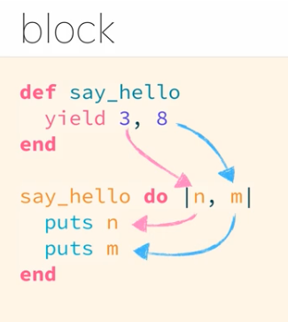

---
# SEO
title: Block
description: Block
# image: 在社交媒体卡片中显示的缩略图
keywords: [Block, Ruby]
sidebar_position: 11
---

# Block 簡介

Block 就是程式碼區塊

```ruby
5.times do |i|
  puts i
end
```

這段 do ~ end 就是 Block

```ruby
p (1..100).select { |n| n.odd? }
```

```ruby
1.upto(10) { |n| puts n }
```

這段{ } 也是 Block

## Block 是一段程式碼

Block 是一段，不會被主動執行的程式碼，<br />
Block 無法單獨存活 以下會是語法錯誤

```ruby
{
  puts "我是大括號型的Block"
}

do
  puts "我是do end型的Block"
end
```

從前面例子可知，有兩種寫法：

### do..end

### 大括號式寫法

:::note
Block 就像寄生蟲，依附在方法後面，但 Block 會不會執行，要看宿主臉色
:::

### yield 方法 => 代表暫時要把控制權讓給方法後面的寄生蟲 Block

> yield 方法就是要把控制權轉讓給 Block(執行完會把控制權交回)

```ruby
def say_hello
  puts "hi,你好"
end

say_hello

puts "there!"

#會執行
#"hi,你好"
#"there"
```

加上 Block

```ruby
def say_hello
  puts "1.hi,你好"
  yield
  puts "3.hii,大家好"
end

say_hello {
  puts "2.here!"
}

puts "4.there!"
#會陸續輸出
#1.hi,你好
#2.here!
#3.hii,大家好
#4.there!
```

## yield 控制權轉讓的時候

### 控制權轉讓時，送給 Block 伴手禮



有時會在 Block 中看到“|n|”這是區域變數<br />
看到這個區域變數可以知道宿主在轉讓控制權的同時有拋出值出來<br />
而這裡 n 就是 yield 拋出來的 3

```ruby
def say_hello
  yield 3
end

say_hello { |n|
  puts n
}
# 3
```

伴手禮值還可以不只一個：

```ruby
def say_hello
  yield 3, 5
end

say_hello { |n, m|
  puts n
  puts m
}
# 3 5
```

### Block 完成的時候，也會帶值回來

當 Block 完成時，會自動回傳 Block 的最後一行執行結果

```ruby
def test_two
  if yield(2) # true
    puts "對，是2" # true會印出這行
  else
    puts "不對，不是2"
  end
end

test_two { |n|
  n == 2   # Block 完成時，會自動回傳 Block 的最後一行執行結果
  # true
}

def test_two
  if yield(3) #false
    puts "對，是2"
  else
    puts "不對，不是2" #false印出這行
  end
end

test_two { |n|
  n == 2  # Block 完成時，會自動回傳 Block 的最後一行執行結果
  # false
}
```

:::note
在 Block 裡不使用 return
:::

## 練習題：

練習完成土砲陣列的 select 方法：

```ruby
def my_select(list)
end

p my_select([1, 2, 3, 4, 5]) { |i| i.odd? }
```

正解以下：

```ruby
def my_select(list)
  result = []
  list.each do |ｎ|
   result << n if yield(n)
  end
  result
end

p my_select([1, 2, 3, 4, 5]) { |i| i.odd? }
# 回傳[1, 3, 5]
```

## Block 其實不是參數

## 物件化的 Block

### Proc ＝> 把 Block 物件化

### lambda
