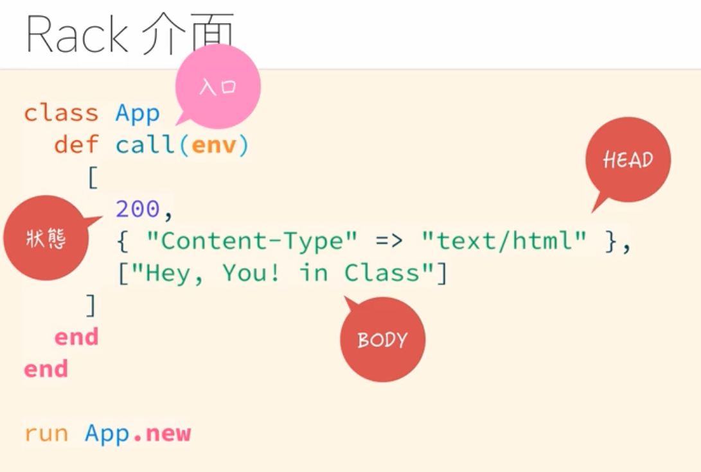
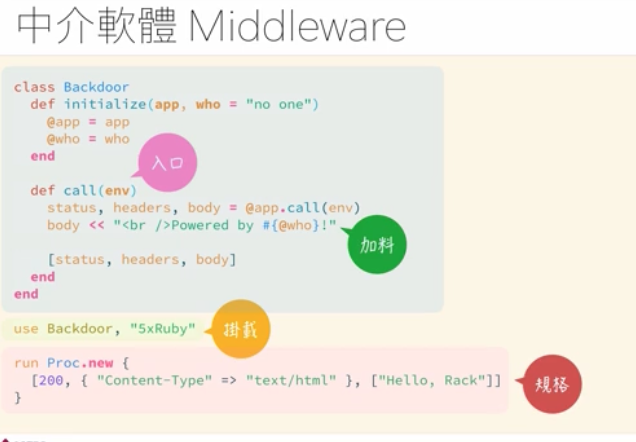
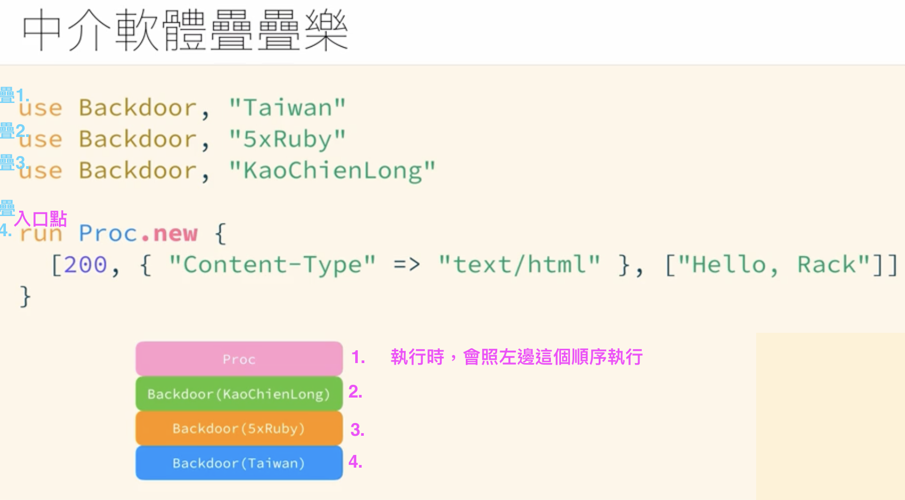
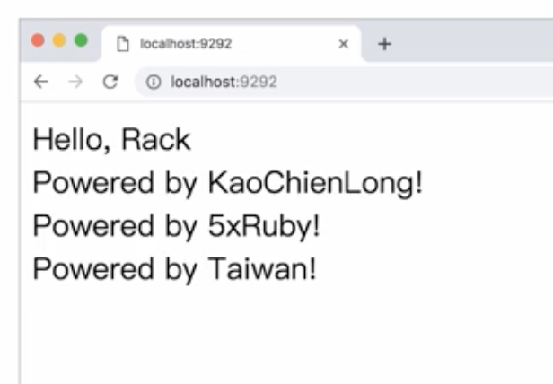
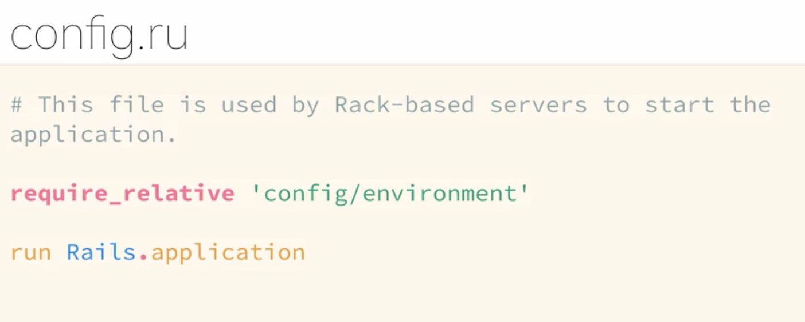

---
# SEO
title: Web 篇之 Rack
description: Web 篇之 Rack
# image: 在社交媒体卡片中显示的缩略图
keywords: [Web 篇之 Rack, Ruby]
sidebar_position: 13
---

# Web 篇之 Rack(伺服器介面)

Rack：https://rack.github.io/

## 簡介

:::note
Rack 是一個 Ruby Web 框架的中間件（middleware）接口，它提供了一個標準的介面，<br />
讓不同的 Web 框架和 Web 伺服器之間能夠互相配合。<br />
Rack 的目標是簡化 Ruby Web 應用程序的開發和部署。<br />

Rack 提供了一種標準的 HTTP 請求和響應的表示形式，並定義了一套中間件介面，<br />
允許你使用不同的中間件來擴展和自定義你的 Web 應用程序。<br />
它的基本概念是建立一個可以處理 HTTP 請求的應用程序（App）<br />

以下是一個簡單的 Rack 應用程序的例子：

```ruby
# my_app.rb

class MyApp
  def call(env)
    # Rack 規範要求應用程序返回一個包含 HTTP 狀態碼、標頭和正文的數組
    [200, {'Content-Type' => 'text/plain'}, ['Hello, Rack!']]
  end
end
```

在這個例子中，MyApp(類別) 是一個符合 Rack 規範的應用程序。它實現了一個 call 方法，<br />
該方法接收一個包含 HTTP 環境信息的 hash env，然後返回一個數組，<br />
其中包含 HTTP 狀態碼、標頭和正文<br />

使用 Rack 啟動這個應用程序：

```ruby
# config.ru

require './my_app'

run MyApp.new
```

上面的 config.ru 文件是 Rack 應用程序的配置文件，它指定了要運行的 Rack 應用程序<br />

然後你可以使用 rackup 命令啟動這個應用程序

```bash
$ rackup config.ru
```

這將啟動一個 Web 伺服器，默認綁定到 http://localhost:9292。<br />
你可以在瀏覽器中訪問這個 URL，或使用工具如 curl 測試。<br />

Rack 提供了一個非常簡單而靈活的方式來構建 Web 應用程序。<br />
它被廣泛使用，並為 Sinatra、Ruby on Rails 等框架提供了基礎<br />
透過中間件的使用，你可以添加各種功能，例如日誌、靜態文件服務、會話管理等。<br />

:::

## Rack

Ruby 實作的網站伺服器介面<br />
就像是一個規格:

:::note

這裡是 Rack 的規格

> 提供一個能夠回應 call 方法的物件，並且回傳一個包含以下三個元素的陣列：<br />
> 1.HTTP 狀態(格式:數字)<br />
> 2.HTTP Header(格式:Hash)<br />
> 3.HTTP Body(格式:陣列)<br />

:::

### HTTP 狀態(格式:數字)

:::note

可根據網站回應的「數字」，得知目前網站的狀態：<br />
• 「一切都正常」的 200<br />
• 「這個頁面目前不在這裡，請你去這裡看看」的轉址 301<br />
• 「不知道為什麼，東西不在這裡」的找不到頁面 404<br />
• 「伺服器錯誤」的 500<br />

:::

## 安裝 Rack:我的 ruby 到底有沒有 rack？

方法 1.通過命令行檢查你的 Ruby 環境是否已安裝 Rack

```bash
# 使用 gem 命令：(打開終端或命令提示字元窗口，然後輸入以下命令：)
$ gem list rack
# 如果 Rack 已經安裝，你應該會看到包含 "rack" 的行，並且顯示已安裝的版本號。
# 如果沒有出現相關的行，那麼 Rack 尚未安裝
```

方法 2.檢查 Gemfile（如果有的話）：<br />
如果你的專案使用了 Bundler，查看專案目錄中的 Gemfile 文件。如果在 Gemfile 中有類似以下的行

```bash
gem 'rack'
```

那麼 Rack 已經作為依賴包含在你的專案中。你可以運行以下命令來安裝依賴：<br />

```bash
$ bundle install
```

### 安裝 rack 之後，再安裝 rackup

要使用 rackup 指令，你需要確保已經安裝 Rack。<br />
rackup 是 Rack 提供的一個命令行工具，用於啟動 Rack 應用程序。<br />

可以使用以下命令安裝 Rack：

```bash
$ gem install rack
```

這個命令會將 Rack 安裝到你的 Ruby 環境中。

若找不到 rackup 這個指令，依照官網方式繼續安裝 rackup:

```bash
$ gem install rackup
```

安裝完成後，你就應該能夠使用 rackup 命令了。<br />

確認 Rack 是否成功安裝：

```bash
rackup -v
```

## 實作：

先到專案資料夾下，建立:

```bash
$ mkdir rack_demo # 創建資料夾
$ cd rack_demo # 進入該資料夾
$ rackup # 通常在安裝ruby就有了 沒有會需要安裝
# 回傳 configuration ＝> 沒有找到config.ru的檔案 (ru就是rackup的縮寫)
$ touch config.ru # 新增這個檔案
$ code . # 開啟vscode
```

### config.ru

所以打開編輯器 config.ru 檔案:

先小試身手，寫上：

```ruby
# 在config.ru寫入

run do |env|
  [200, {}, ["Hello Worldddd"]]
end
```

在終端機同一資料夾下，輸入：

```bash
$ rackup

# 看到port
# [2023-11-19 14:32:15] INFO  WEBrick 1.8.1
# [2023-11-19 14:32:15] INFO  ruby 2.7.2 (2020-10-01)
# [2023-11-19 14:32:15] INFO  WEBrick::HTTPServer#start:  port=9292
```

就在網址列上輸入 localhost:9292
就會出現在 config.ru 寫的內容"Hello Worldddd"

### 繼續寫

回到練習要求裡：<br />

> 提供一個能夠回應 call 方法的物件，並且回傳一個包含以下三個元素的陣列：<br />
> 1.HTTP 狀態(格式:數字)<br />
> 2.HTTP Header(格式:Hash) 'content-type'要小寫<br />
> 3.HTTP Body(格式:陣列)<br />

把 Proc.new 改成成 lambda "->"<br />
然後 Rack 的规范要求 HTTP 头部的名称（header name）应该是小写的'content-type'<br />

```ruby
# config.ru要run一個主程式
run ->(env) {
  [200, { 'content-type' => 'text/html' }, ['Hello, Rack!content-type to write lowercase']]
}

# 或這樣：
run Proc.new {
  [200, { 'content-type' => 'text/html' }, ['Hello, Rack!content-type to write lowercase']]
}
```

到終端機中輸入 rackup，出現了 port<br />
就在網址列上輸入 localhost:9292<br />
就會出現'Hello, Rack!content-type to write lowercase'這段文字

## 只要有支援 call 方法的物件就可以了(rack 要求的規格)

```ruby
class App
  # call就是入口
  def call(_env)
    [
      200, # 狀態
      { 'content-type' => 'text/html' }, # head
      ['HeyHey'] # body
    ]
  end
end

run App.new

```

其實 Rack 要的就是一個物件，不一定要用 Proc 來做出物件，<br />
怎麼做出物件沒差，只要確保有 call 方法就好<br />
上面的 Proc 和 lambda 其實都有內建 call 方法，<br />
現在自己寫一個類別，然後寫入 call 方法<br />

```ruby
# 自己寫類別
class Cat
  def call(env)
    [200, { 'content-type' => 'text/html' }, ['Hello, u write in your own class']]
  end
end

mack = Cat.new # 創建實體物件

run mack


```

:::note

> 用類別的寫法，就是會比較具有彈性！可以直接增加 public/private 等方法，<br />
> 透過物件程式導向的方式讓 class 具有更多彈性並且有更多功能<br />

:::



## 在上面 config.ru 文檔中還可以寫入一些東西:中介軟體 Middleware

:::note

中介軟體（Middleware）是軟體架構中的一種元件或模組，位於應用程式的請求/回應處理流程中，<br />
用於增強、修改或擴展請求或回應的功能。在網頁開發中，中介軟體通常用於處理 HTTP 請求和回應，<br />
執行一些與應用程式的核心業務邏輯分離的任務。<br />

在 Ruby 的網頁開發中，Rack 提供了一個中介軟體介面，允許開發者透過中介軟體來處理請求和回應。<br />
中介軟體可以在請求到達應用程式之前、應用程式處理請求過程中，或者在應用程式生成回應後進行處理。<br />
這種模型使得開發者能夠輕鬆添加、組合和重複使用功能，而不必直接修改應用程式代碼。<br />

:::

### middleware 也要符合 rack 的規範

在 config.ru 檔案中的<br />
run 方法指定了應用程式的主處理邏輯<br />
use 方法用於添加中介軟體<br />
中介軟體的執行順序由 use 方法的順序決定<br />

middleware 需要寫上 initialize 初始化，並且要接兩個參數(app, who="no one")<br />

問題：為什麼需要 rack
問題：middleware 到底要用來幹嘛
問題:ruby 的 middleware 都怎麼寫
問題: 為什麼 middleware 會用 class 類別來寫？
問題:為什麼中介軟體的類別需要初始化
問題：rackup 在 run 入口點.call 時 middleware 是在什麼時候執行的

## 補充：

config.ru 文件在 Rack 中的作用，是指定 Rack 應用程式的配置。<br />
rackup 命令用於運行 Rack 應用程式，並且它預設會在當前工作目錄下查找 config.ru 文件作為配置文件。<br />

具體而言，config.ru 文件包含了一些配置信息，最重要的是定義了 Rack 應用程式。<br />
在這個文件中，你會找到類似如下的程式碼：<br />

```ruby
# config.ru

require './my_rack_app'
run MyRackApp.new

```

上述程式碼中，require './my_rack_app' 用於加載 Rack 應用程式的程式碼，<br />
而 run MyRackApp.new 則表示運行 MyRackApp 類的實例作為 Rack 應用程式。<br />
這樣，config.ru 文件告訴 rackup 如何啟動你的 Rack 應用程式。<br />

### 為什麼需要 config.ru 文件

為什麼需要這個文件呢？

> 1.約定： config.ru 是 Rack 約定的配置文件名，rackup 預設會尋找這個文件。<br />
> 這種約定促使了專案的一致性，讓不同的 Rack 應用程式可以在運行時通過相同的方式配置。<br />

> 2.包含必要信息： config.ru 包含了啟動 Rack 應用程式所需的必要信息，例如『應用程式的引入 require 和初始化 initialize』。<br />
> 這使得運行時可以簡單地通過 rackup 命令讀取這個文件並啟動應用程式。<br />

如果你的 Rack 應用程式的程式碼分散在多個文件中，你可以在 config.ru 中使用 require 或其他方式將它們整合在一起。<br />
這樣，rackup 命令就知道如何組織你的應用程式並啟動它。<br />

### 為什麼需要 call 方法？

在 Rack 中，call 方法是 Rack 應用程式介面的一部分。<br />
Rack 應用程式是一個物件，它必須實現 call 方法，以便 Web 伺服器能夠呼叫它來處理 HTTP 請求。<br />
這是一種約定，讓不同的 Rack 應用程式能夠遵循相同的介面規範。<br />

具體而言，call 方法接受一個環境（env）參數，該參數是一個包含請求信息的 Hash。<br />
env 哈希中包含了諸如 請求方法、路徑、請求頭、查詢參數等信息。<br />
在 call 方法內部，你可以使用這些信息來處理請求，生成相應的響應。<br />

```ruby
# 一個簡單的 Rack 應用程式示例
class MyRackApp
  def call(env)
    # 處理請求邏輯
    request_method = env['REQUEST_METHOD']
    path_info = env['PATH_INFO']

    # 生成響應
    status = 200
    headers = { 'Content-Type' => 'text/plain' }
    body = ["Hello, Rack! Request method: #{request_method}, Path: #{path_info}"]

    [status, headers, body]
  end
end

```

在上述示例中，MyRackApp 類實現了 call 方法，<br />
該方法接受 env 參數並使用其中的信息生成一個簡單的 HTTP 響應。<br />

### 為什麼需要 call 方法和 env 參數呢？

1.標準介面： Rack 採用了標準的介面規範，使得不同的 Rack 應用程式都能夠實現相同的介面。<br />
這種一致性讓 Rack 能夠與各種 Web 伺服器協同工作。<br />

2.抽象請求和響應： 通過將請求信息抽象為 env 參數，Rack 提供了一個通用的方式來表示請求，<br />
而 call 方法則提供了一個通用的方式來表示響應。<br />
這種抽象使得 Rack 應用程式可以更容易地適應不同的 Web 伺服器和中介軟體。<br />

3.中介軟體支援： 中介軟體是 Rack 中的重要概念，它們也是實現了 call 方法的物件。<br />
中介軟體可以在請求進入應用程式之前或響應離開應用程式之後執行額外的邏輯。<br />
這種設計允許開發者輕鬆地使用和組合各種中介軟體來擴展應用程式的功能。<br />

總體而言，call 方法和 env 參數是 Rack 中用於處理 HTTP 請求和生成 HTTP 響應的核心機制，<br />
它們提供了一種通用的、標準的方式來定義和執行 Rack 應用程式。<br />

### 為什麼要使用 run 呢?

在 Rack 中，run 方法用於指定要運行的 Rack 應用程式。<br />
具體而言，run 方法用於告訴 Rack 伺服器應該使用哪個物件作為主要的 Rack 應用程式來處理傳入的 HTTP 請求<br />

```ruby
# 範例
run MyRackApp.new

```

在上述範例中，run 方法指定了 MyRackApp.new 作為主要的 Rack 應用程式。<br />
這意味著當有 HTTP 請求到達時，Rack 伺服器會將該請求交給 MyRackApp 的實例的 call 方法來處理<br />

為什麼要使用 run 方法呢？<br />

> 1.標識主要應用程式： 在一個 Rack 配置文件（如 config.ru）中，可能會定義多個 Rack 應用程式或中介軟體。<br />
> 使用 run 方法能夠明確標識出哪一個是主要的應用程式，即處理實際業務邏輯的應用程式。<br />

> 2.支援中介軟體： run 方法的參數通常是一個實現了 Rack 應用程式介面的物件。<br />
> 這意味著你可以將中介軟體和應用程式組合起來，通過 run 方法指定整個處理鏈。中介軟體本身也是實現了 call 方法的物件，因此可以巢狀使用。<br />

> 3.清晰的配置： 使用 run 方法可以讓 Rack 的配置更加清晰和易於理解。通過簡單的一行程式碼，你可以明確指定哪個物件應該處理主要的業務邏輯。<br />

總體而言，run 方法是 Rack 配置文件中的一個重要指令，用於指定主要的 Rack 應用程式。通過這個方法，你可以構建出複雜的應用程式結構，包括中介軟體和其他處理邏輯。<br />

### 為什麼使用 use 關鍵字?

在 Rack 中，use 方法用於將中介軟體（Middleware）添加到處理鏈中。<br />
中介軟體是實現了 Rack 應用程式介面的物件，它可以在請求進入應用程式之前或響應離開應用程式之後執行額外的邏輯。<br />

```ruby
# 範例
use MyMiddleware
run MyRackApp.new

```

在上述範例中，use MyMiddleware 將 MyMiddleware 中介軟體添加到了處理鏈中，<br />
然後 run MyRackApp.new 指定了主要的 Rack 應用程式<br />

為什麼使用 use 方法呢？<br />

1.組合中介軟體： use 方法允許你將多個中介軟體按照順序添加到處理鏈中，構建複雜的請求處理流程。<br />
每個中介軟體都可以執行特定的功能，例如日誌記錄、身份驗證、緩存等。<br />

2.清晰的配置： 使用 use 方法可以使 Rack 配置文件更加清晰，<br />
明確地列出了請求處理鏈上的中介軟體和應用程式。這使得配置更易於理解和維護。<br />

3.靈活的中介軟體支援： 中介軟體是 Rack 中一個強大的概念，通過 use 方法，<br />
你可以輕鬆地添加、移除或替換中介軟體，調整應用程式的功能。<br />

總體而言，use 方法是 Rack 中用於添加中介軟體的關鍵指令。<br />
通過使用 use，你可以構建靈活且功能強大的 Rack 應用程式，滿足不同場景下的需求。<br />

### 掛載 middleware

```ruby
class Backdoor
  def initialize(app, who = 'nobody') # middleware必要初始化
    @app = app
    @who = who
  end

  # Rack規格：call就是入口 call會回傳一個陣列
  def call(env)
    status, headers, body = @app.call(env)

    body << "<br />hacked by #{who}"
    [
      status, # Rack規格： 1.HTTP狀態(格式:數字)
      headers, # Rack規格： 2.HTTP Header(格式:Hash)
      body # Rack規格： 3.HTTP Body(格式:陣列)
    ]
  end
end

# 掛載middleware 要初始化 => 符合rack規範＆類別(有call方法)
use Backdoor, '5xruby'# 這個是intialize要留這二個參數對應這個引數

run proc.new {
  [200, { 'content-type' => 'text/html' }, ['Hello, Rack!！']]
}

# 輸出 Hello, Rack!！
# 輸出   hacked by 5xruby
```



### middleware 就像疊疊樂


執行順序


這些都是攸關 ruby on rails => 它就是一種 rack 應用程式<br />
打開 rails 專案，會發現裡面一定有 config.ru 的檔案<br />


也有 run 進入點<br />
龐大的框架包在這個應用程式裡，<br />
只給你一個 run 進入點 => 化繁為簡<br />
Rails.application 本身就是可以 call 的物件<br />
也有 call 的方法，<br />
這個物件被 call 之後,會回傳一個陣列，而陣列裡面會有三個元素:[狀態,header,body]<br />
由此可知，rails 本身就是大型的 rack 應用程式<br />

事實上，rails 也掛了一大串的 middleware

```ruby
$ rails middleware
```
