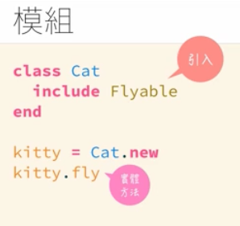

---
# SEO
title: 物件導向程式設計
description: 物件導向程式設計
# image: 在社交媒体卡片中显示的缩略图
keywords: [物件導向程式設計, Ruby]
sidebar_position: 12
---

# 物件導向程式設計 Object-Oriented Programming

為什麼要使用 OOP?想透過擬人化的過程，讓你的程式碼看得懂

## 什麼是物件？

在 Ruby 裡，幾乎什麼都是物件

### 在 Ruby 裡，什麼不是『物件』？

Block 不是物件，{ } 和 do..end 不是物件，無法單獨存活

## 類別 class 與 實體 instance


### 如何定義類別？

類別的命名規定 ＝ 必須是常數，常數首字大寫

```ruby
# 透過關鍵字class 來定義類別-並給這個類別取名
# 常數首字大寫
class Cat
end
```

繼續在這個類別裡定義方法

```ruby
# 透過關鍵字class 來定義類別-並給這個類別取名
# 常數首字大寫
class Cat
  def eat(food) # 方法
    puts "#{food} 非常好吃又健康"
  end
end
```

### 使用類別(烤盤)來建立實體(雞蛋糕)

```ruby
class Cat
  def eat(food) # 方法
    puts "#{food} 非常好吃又健康"
  end
end

# 建立實體.new當作壓模
kitty = Cat.new
kitty.eat "鱸魚" # 輸出 “鱸魚 健康又好吃”

nancy = Cat.new
nancy.eat "小魚餅乾"
```

## inheritance 繼承/分類 Cat < animal

:::note
繼承/分類的用法是因為把共同的特徵放在同一個分類 class<br />
:::
就像生物的界門綱目科屬種=>把共同的特徵放在同一個分類 class<br />
『靈長目』都有『五指對握』的功能<br />
與其說是『繼承』，不如說是『分類』<br />
例如：把動物 || 靈長目 || 人類 做分類

```ruby
class 動物
end

class 靈長目 < 動物
  def 五指對握
  end
end

class 人 < 靈長目
end

# 建立實體

me = 人.new
you = 人.new

me.五指對握()
you.五指對握()
```

意思是，雖然我沒有在人的類別下定義"五指對握"的方法，<br />但是在人的所屬分類中 < 靈長目 這個類別下所定義的方法，人也可以使用該類別下所定義的方法

### 練習題：

狗跟貓類別都有 walk 和 eat 的方法

```ruby
class Animal
  def walk(mins)
    puts "it's #{mins} walk."
  end
  def eat(food)
    puts "#{food} is so yum!"
  end
end

class Dog < Animal
end

class Cat < Animal
end

mack = Dog.new
mack.walk(4)
mack.eat "袋鼠罐頭"
# 輸出it's 4mins walk.
# 輸出 袋鼠罐頭 is so yum!
```

## 物件的初始化 initialize（這方法不能拼錯）

```ruby
class Cat
  def initialize
    puts "喵喵喵！"
  end
end

kitty = Cat.new # 輸出 喵喵喵！
```

### new 的時候也可以順便帶引數給 initialize(參數)

當你的 initialize 有設定參數時，你在創建實體時使用.new() 也要把引數寫入進去

```ruby
class Cat
  def initialize(name, age)
    #實體變數
    @name = name
    @age = age
    puts "喵喵喵！"
  end
end

kitty = Cat.new('kk', 18)
```


### new 與 initialize 關係

是前後關係，new 是壓模成實體，initialize 是誕生時做的第一件事<br />

### 傳給 new 方法的引數，後續會由 initialize 方法收下

當 initialize 有參數，new 一定也要接收引數，不然會報錯

## 實體方法 與 類別方法

### 實體方法 instance method


先了解什麼是實體? ＝> 車輪餅是實體,kitty 是實體<br />
實體方法 ＝> 可以直接作用在實體上的方法

```ruby
class Cat
  def eat(food) # 方法
    puts "#{food} 非常好吃又健康"
  end
end

# 建立實體.new當作壓模
kitty = Cat.new
kitty.eat "魚" # 實體方法 可以直接作用在實體上的方法
```

## 類別方法 class method

作用在類別上的方法<br />
需要在方法前面加上 self

```ruby
class Cat
  def self.all
    puts "全部的貓"
  end
end

Cat.all # 輸出 全部的貓
```

### 哪裡會用到類別方法


rails 會常用到，這裡就是使用 Candidate 類別下的 all 方法來取得所有候選人的資料

## 實體變數 與 類別變數


## @實體變數 instance variable

> 實體變數命名時，是一個@開頭 <br />
> 實體變數存活在每個獨立的實體內(車輪餅的口味) <br />
> 在實體裡面，可自由取用的變數 <br />

```ruby
class Cat
  def initialize(name, age)
    #實體變數
    @name = name
    @age = age
    puts "喵喵喵！"
  end

  #  在實體裡取用實體變數
  def say_my_name
    puts "我是 #{@name}" #取用了實體變數@name
  end
end

kitty = Cat.new('kk', 18)
kitty.say_my_name
```

### 若是要從實體外(外部程式碼)取用實體變數 => 設定 Getter 方法

以下是錯誤寫法

```ruby
class Cat
  def initialize(name, age)
    #實體變數
    @name = name
    @age = age
    puts "喵喵喵！"
  end

  def say_my_name
    puts "我是 #{@name}"
  end
end

kitty = Cat.new('kk', 18)
puts kitty.name
# 會報錯 undefined method `name' for #<Cat:0x00007f0341806f88 @name="kk", @age=18>
```

無法從外部程式碼直接使用點記法來取用實體變數，需要在類別下定義『Getter』方法<br />

將上面程式碼做修正，建立 getter：

```ruby
class Cat
  def initialize(name, age)
    #實體變數
    @name = name
    @age = age
    puts "喵喵喵！"
  end

  def say_my_name
    puts "我是 #{@name}"
  end

  # 設定了getter方法
  def name
    return @name
  end
end

kitty = Cat.new('kk', 18)
puts kitty.name  # 成功取的 實體變數
```

:::note
在 Ruby 中，你可以使用 getter 方法（或稱為讀取方法）來取得實體變數的值。<br />Getter 方法是一種允許外部程式碼獲取實體變數值的方法。<br />通常，Getter 方法的名稱與實體變數相對應，但前面加上 attr\_。你也可以自己定義 getter 方法。<br />

```ruby
class Person
  def initialize(name, age)
    @name = name
    @age = age
  end

  # Getter 方法
  def name
    @name
  end

  def age
    @age
  end
end

# 創建一個 Person 對象
person = Person.new("John", 25)

# 使用 getter 方法獲取實體變數的值
puts person.name  # 輸出: John
puts person.age   # 輸出: 25
```

:::

### 用 attr_reader，可以自動創建 getter 方法

> 可以用 attr_reader 可以自動創建 getter 方法 <br />
> 可以用 attr_writer 可以自動創建 setter 方法 <br />
> 可以用 attr_accessor 可以同時自動創建 getter 和 setter 方法(更簡潔) <br />

```ruby
class Person
  attr_reader :name, :age

  def initialize(name, age)
    @name = name
    @age = age
  end
end

Jane = Person.new('Jane', 28)

puts Jane.name  # 輸出 "Jane"
puts Jane.age   # 輸出 28
```

### 用 attr_writer，可以自動創建 setter 方法

先土法煉鋼的手動設定 setter 方法：
:::note
在 Ruby 中，setter 方法用於『設定（或修改）實體變數的值』。<br />
Setter 方法通常用於允許外部程式碼修改物件的內部狀態。<br />
Setter 方法的名稱通常與實體變數相對應，但以等號（=）結尾<br />

```ruby
class Person
  attr_reader :name, :age

  def initialize(name, age)
    @name = name
    @age = age
  end

  def name=(new_name)
    @name = new_name
  end

  def age=(new_age)
    @age = new_age
  end
end

Jane = Person.new('Jane', 28)

puts Jane.name # 輸出''Jane'
puts Jane.age # 輸出 28

puts Jane.name=('Smith')  # 輸出''Smith'
puts Jane.age=(32)  # 輸出32
```

:::

現在用 attr_writer 來寫 setter

```ruby
class Person
  attr_reader :name, :age

  attr_writer :name,:age

  def initialize(name, age)
    @name = name
    @age = age
  end

  # def name=(new_name)
  #   @name = new_name
  # end

  # def age=(new_age)
  #   @age = new_age
  # end
end

Jane = Person.new('Jane', 28)

puts Jane.name # Jane
puts Jane.age # 28
puts Jane.name=('Smith') #Smith
puts Jane.age=(32) # 32

```

### attr_accessor

改寫上面：

```ruby
class Person
  # attr_reader :name, :age
  # attr_writer :name,:age
  attr_accessor :name, :age #這一行抵前面兩行

  def initialize(name, age)
    @name = name
    @age = age
  end

  # def name=(new_name)
  #   @name = new_name
  # end

  # def age=(new_age)
  #   @age = new_age
  # end
end

Jane = Person.new('Jane', 28)

puts Jane.name
puts Jane.age
puts Jane.name=('Smith')
puts Jane.age=(32)
```

### 經由上面，不要誤會，要切記在 Ruby 中根本沒有屬性！


> 是 Ruby 可以適時的省略小括號，方法看起來像屬性(全部都是方法)

## 補充冷知識 1：

在 Ruby 中，1 + 2 = 3 是加法嗎？<br />
事實上，不是<br/>
在 Ruby 中數字是『數字物件』<br/>
來解析一下下面的意思<br/>

```ruby
puts 1 + 2
```

這不是單純的 1+2，而是這樣的邏輯：

```ruby
puts 1.+(2)
# 數字物件1用.號呼叫了加法這個方法，並帶入參數2 ＝> 輸出3
```

## 補充冷知識 2：

來解析一下下面的意思<br/>

```ruby
puts !true # false （語法糖寫法）
puts !!true # true
# 事實上，true在ruby中也是物件，還原是這樣：
puts true.!.!
```

## rails 的 view 可以使用 Controller 建立的實體變數是怎麼回事？

> 在 View 中大量的使用實體變數，為什麼東西在 Controller 中建立了實體變數，卻可以在 View 裡面拿到呢？

## @@類別變數 class variable

在類別方法裡面可以取用的變數

```ruby
class Cat
  # 建立類別變數counter
  @@counter = 0

  def initialize
    # 每次Cat類別new出實體來，initialize就會被執行，@@counter就會+1
    @@counter += 1 # 這個counter在這個Cat類別裡是共用的
  end
end

5.times { Cat.new }

puts Cat.counter # 無法直接取用@@counter類別變數，印不出來會報錯
```

所以為了能夠取用@@類別變數，還是需要寫上 self.類別方法來回傳@@類別變數：

```ruby
class Cat
  # 建立類別變數
  @@counter = 0

  def initialize
    # 每次Cat類別new出實體來，intialize就會被執行，@@counter就會+1
    @@counter += 1 # 這個counter在這個Cat類別裡是共用的
  end

  def self.counter # 類別方法
    @@counter
  end
end

5.times { Cat.new }

puts Cat.counter # 輸出 5
```

總結：


### 補充 gpt:

:::note
在 Ruby 中，可以使用類別方法（class method）或實例方法（instance method）來訪問類別變數，而不需要特別的 getter 方法。<br />

類別變數使用 @@ 開頭，而且它們與實例變數不同，不能通過實例的方法直接訪問。但你可以使用類別方法或實例方法來取得類別變數的值。<br />
:::

#### 使用類別方法來取得@@類別變數

```ruby
class MyClass
  @@class_variable = "I am a class variable"

  def self.get_class_variable
    @@class_variable
  end
end

# 使用類別方法取得類別變數的值
puts MyClass.get_class_variable  # 輸出: I am a class variable
```

#### 使用實體方法來取得@@類別變數

```ruby
class MyClass
  @@class_variable = "I am a class variable"

  def get_class_variable
    @@class_variable
  end
end

# 實例化類別
obj = MyClass.new

# 使用實例方法取得類別變數的值
puts obj.get_class_variable  # 輸出: I am a class variable
```

在實際情況中，你應該根據你的需求來選擇使用類別方法還是實例方法。<br />
如果你需要在不實例化對象的情況下訪問類別變數，則使用類別方法；<br />
如果你需要實例化對象，並使用實例方法來訪問類別變數，則使用實例方法。<br />

## 開放類別 open class(Ruby 的特色)


:::note

> 在 Ruby 中兩個同名的類別 class 撞在一起，不會覆蓋，而是『融合』<br/>
> 幫現有的類別加功能，甚至也能幫內建的類別加功能<br/>

:::

```ruby
class String # 字串類別
  def say_hello
    "hihi #{self}"
  end
end

puts '魯夫'.say_hello # 所有的字串物件都能使用這個方法
puts '喬巴'.say_hello

```

> 由於這個融合的原理，在創建開放類別的方法時，如果你創建方法並使用原來內建的方法名稱，就會覆蓋掉原先內建已經寫好的方法<br />

```ruby
class String # 已有內建字串類別(融合)
  def say_hello
    "hihi #{self}"
  end

  def length #這個方法會蓋掉原來內建字串類別的.length的方法
    100
  end
end

puts '魯夫'.say_hello # 所有的字串物件都能使用這個方法
puts '喬巴'.say_hello
puts [1,2,3].length # 預期會出現3 但是輸出卻是100

```

再舉一個內建類別的例子：

```ruby
class Integer
  def +(n)
    100
  end
end

puts 1.+(2) #預期會輸出3 但卻輸出100 因為加法被你建立的開放類別同名方法覆蓋掉了
puts 2 + 3 # 100
```

另一個例子：

```ruby
class Integer
  alias :old_plus :+
  def +(n)
    puts "hey hey hey!"
    self.old_plus(n)
  end
end

puts 1 + 2 # 輸出 hey hey hey! 3

puts 2 + 3 # 輸出 hey hey hey! 5

```

> rails 大量的使用開放類別的技巧 <br />
> rails 在 web 方面特化版的 Ruby <br />

### 補充：$ rails

```bash
$ rails console # 或是 $ rails c 即可進入rails控制台介面

# -- rails環境 --
# 在ruby中若想要印出5天前的日期該怎麼寫？
$ 5.days.ago # 印出5天前的日期給你
$ 10.megabyte
```

## 存取控制: public / private / protected

Ruby 提供了三種存取控制關鍵字：public、private 和 protected。<br />
這些關鍵字用於控制方法的訪問權限，以確保對象的狀態不會被意外更改或訪問<br />

像是遙控器，有些功能不想讓外部直接存取，寫程式時也是一樣，像這樣的情況叫做『封裝』<br/>

:::note
封裝-encapsulation<br />
外部程式碼無法使用，只有在這個類別裏面可以使用，透過<br/>
public / private / protected
:::

### public:這些方法可以被任何人（包括外部程式碼）訪問。

在類別裡，沒有特別寫存取控制的關鍵字的方法，幾乎都是 public 方法

```ruby
class Cat
  # public
  def say_hello # public
  # 實作
  end
end

kitty = Cat.new
kitty.say_hello
```

### Private 關鍵字:可以將方法設置為私有的，只能在類別內部使用。

私有方法不能在類別外部被直接調用，只能在類別的內部進行調用。<br />
如果從外部訪問私有方法，會出錯

```ruby
class Dog
  private
  def gossip
    puts "我跟你說 你不能跟別人說"
  end
end

mack = Dog.new
mack.gossip  # 會報錯
```

私有方法，還有另一種寫法

```ruby
class Dog
  def gossip
    puts "我跟你說 你不能跟別人說"
  end

  private :gossip # 這個gossip就會變私有方法
end
```

ruby 的 private 存取控制和其他程式語言很不同<br />

在 ruby 的世界，如果你要呼叫某一個物件身上的方法，<br />
例如像之前 kitty 中 say_hello 這個方法<br />
在別的程式語言會是由 kitty 去呼叫.say_hello 這個方法<br />
但在 ruby 裡，是對著『kitty』物件，送了一個叫 say_hello 的訊息<br />
有點像發送訊息的概念<br />

#### 訊息 與 接收者

```ruby
class Cat
  def say_hello # public
  # 實作
  end
end

kitty = Cat.new #做出了kitty這個實例物件
kitty.say_hello
# kitty 其實是接收者
# say_hello 是訊息
```

也就是對 kitty 這個接收者(receiver)，發送了一個 say_hello 的訊息<br />
然後 kitty 再去類別裡找是否有這個方法

:::note

> 在 ruby 中，只有在類別裡能使用，這是因為：<br />
> private = 不能有明確的訊息接收者(receiver)<br />
> 也就是說，在呼叫方法的時候，不會有小數點<br />

:::

```ruby
class Cat
  def say_hello
  # 實作
    gossip # 私有方法在類別裡被訪問
  end

  private
  def gossip
    puts "我跟你說 你不能跟別人說"
  end
end

kitty = Cat.new
kitty.say_hello # 輸出 我跟你說 你不能跟別人說

```

### Protected 關鍵字:可以將方法設置為受保護的

這意味著它們只能被同一個類別或其子類別的實例訪問<br />
不過基本上你不太需要 protected
:::note

> protected =不限定有沒有明確的訊息接收者<br />
> 事實上，private 更適合保護的概念<br />

:::

## 模組 module

問：我是一隻貓，我希望這隻貓會飛<br />
答: 建立一個鳥類別，然後叫貓去繼承它<br />
但為了飛的功能去建立鳥類別，有點多此一舉<br />

### 定義模組

類別與模組的命名規定 = 必須是常數

```ruby
module ModuleName
end
```

### 類別如何使用模組=> include 模組名

在類別中引入模組，使用 include 關鍵字

```ruby
# 定義一個飛行模組
module Flyable
  def fly
    puts "I believe I can fly!"
  end
end

class Cat # 類別要使用模組，就像加外掛加上include關鍵字
  include Flyable
end

kitty = Cat.new
kitty.fly
```

### 模組跟類別差異

:::ruby

模組沒有繼承功能，不能像類別一樣 human < animal <br/>
模組不能實體化，所以不能直接把模組方法給實體直接使用

:::


### 練習題：

建立一個繼承自動物類別的小鳥類別，並引入一個具有實作飛行方法的飛行模組？<br />

```ruby
# 定義一個飛行模組
module Flyable
  def fly
    puts "我是飛行功能外掛！你現在使用我即有飛行功能！"
  end
end

class Animal
end


class Bird < Animal
  # 引入 飛行模組
  include Flyable
end

class Duck < Animal
    # 引入 飛行模組
    include Flyable
end

twetty = Bird.new
twetty.fly # 我是飛行功能外掛！你現在使用我即有飛行功能！
```

### 模組的 include 和 extend 有什麼差別？

#### include 引入模組 => 可以把模組方法給『實體』使用(實體方法)



#### extend 擴充模組 => 可以把模組方法給『類別』使用(類別方法)


### 如果遇到同名類別？ => namespace

若遇到同名類別..

```ruby
class Cat
end

class Cat
end
```

可以用 namespace 的概念，<br />
用 module 包在外面：<br />

```ruby
module A
  class Cat
  end
end


module B
  class Cat
  end
end

```

那要如何呼叫 module 裡面的類別呢？<br />

```ruby
module A
  class Cat
  end
end


module B
  class Cat
  end
end

kitty = A::Cat.new
nancy = B::Cat.new
```


## 冒號在 Ruby 中代表的意思


