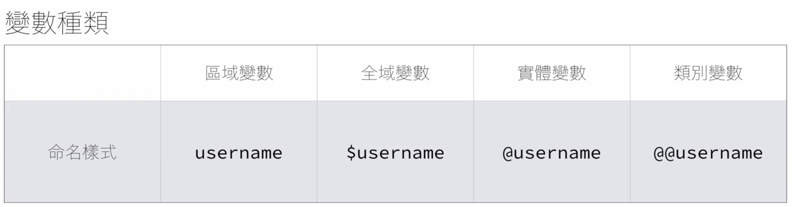

---
# SEO
title: Ruby的變數與常數
description: 變數與常數
# image: 在社交媒体卡片中显示的缩略图
keywords: [變數與常數, Ruby]
sidebar_position: 1
---

# Ruby 的變數與常數

要給變數一個『好名字』
清楚並且具有意義

## 變數

Ruby 中不需要變數『宣告』

```ruby
message = "你好"
puts message ＃印出『你好』的字樣
```

變數就像標籤，本身沒有型態/型別

### 變數種類


前綴詞不同，變數的作用範圍就不同

### 變數指定與使用

```ruby
# 變數指定
a = 1
comic = "七龍珠"

# 一次指定多個變數
x,y,z = [1, 2, 3]

# 使用變數
puts a  # 印出了 1
puts z  # 印出了 3
puts comic  # 印出七龍珠
```

### 等號 ＝> 指定的意思

```ruby
a = 1
a = a + 2  #可以寫成 a += 2
puts a # 印出3

--------
a += 2  # a = a + 2

# 冷知識
a ||= 2 # 這又是什麼？
a =  a || 2 # 如果a變數有存在並設定值，就維持原樣;沒有就指定2

```

### 變數的命名慣例：snake_case 與 camelCase

#### camelCase (Java)

```ruby
firstName
lastName
parseDataString
```

#### snake_case(Python / Ruby)

```ruby
first_name
last_name
parse_data_string
```

### 變數練習題：把下面 x 與 y 的值對調：

記得！等號是指定的意思

```ruby
x = 2
y = 3
```

<br />
方法 1:給他們第三個變數

```ruby
x = 2
y = 3
temp = x  #把x內容指定給temp
x = y  #把y值指定給x
y = temp #把temp值指定給y

puts x
puts y
```

方法 2:x + y 和 x - y

```ruby
x = 2
y = 3

x = x + y # 5
y = x - y
x = x - y

puts x # x = 3
puts y # y = 2
```

方法 3:

```ruby
x = 2 # x = 3
y = 3 # y = 2

x, y = y , x
puts x # x = 3
puts y # y = 2
```

## 常數(首字大寫)

在 Ruby 中要定義常數，就是使用『大寫字母』開頭

```ruby
BOOK = "ruby book"
User = "hello, user"
```

一般來說，在 JS 常數是不能更改的，

```
Ruby特色：在 Ruby 世界中，常數是可以被修改的
```

但通常不會特別去這樣做

### 常數 與 變數有什麼不同？

差別不大，只在常數命名是大寫開頭

## 關鍵字與保留字

在變數命名上，盡量避開關鍵字與保留字
