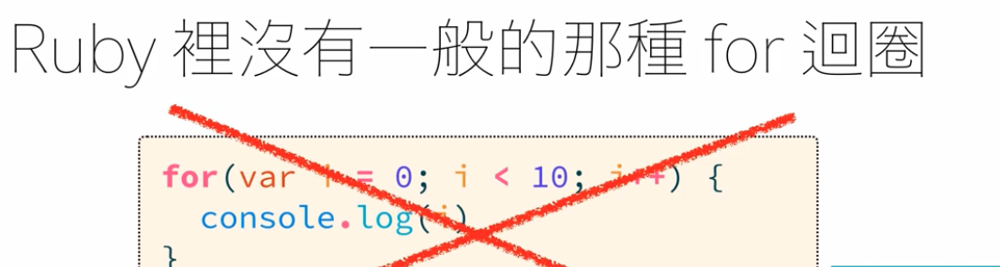

---
# SEO
title: 迴圈與迭代
description: 迴圈與迭代
# image: 在社交媒体卡片中显示的缩略图
keywords: [迴圈與迭代, Ruby]
sidebar_position: 4
---

# 迴圈與迭代

在 ruby 中迴圈總類有：<br />

- for 迴圈
- while 迴圈
- loop 迴圈
- method 式迴圈(Ruby 特有)
- 迭代式迴圈(常用)

## 迴圈與迭代有什麼不同？

> loop 迴圈就是『你就跑個 5 圈吧』 => 一直做重複的事把它做完

<br />

> iteration 迭代就是『你把這五個元素全部都看過一次吧』＝> 通常會有對象，把某個陣列或結果都跑過一次並印出來

## for 迴圈



ruby 的 for 迴圈會像是這樣

```ruby
names = ["Jane","joan","john","shelly"]

for name in names
  puts name
end

# 印出
# Jane
# joan
# john
# shelly
```

## while 迴圈

使用 while 迴圈要注意條件，不然容易陷入無窮迴圈

```ruby
x = 0

while x < 10
  puts x
  x += 1  #改變條件
end

# 以上會輸出0~9的數字
```

### while 的邪惡分身

#### until = while not

這段與前述是一樣的語意

```ruby
x = 0

until x >= 10  # until = while not
  puts x
  x += 1
end
```

#### while = until not

## loop 迴圈 => break

這段程式碼是到 break 這行符合條件才會終止結束這回合

```ruby
i = 0

loop do
  puts i
  i += 1
  break if i > 10
end
```

:::note
do... end 或是 { } 這種東西叫做 Block <br />
ruby 特別寫法
:::

## method 式迴圈

```ruby
5.times do
  puts "hello,ruby"
end

# 印出五次hello,ruby

```

再試看看：

```ruby
1.upto(10) do |i|
  puts "hello, ruby #{i}"
end

10.downto(1) do |i|
  puts "hello, ruby #{i}"
end

```

用習慣 js 會不習慣 ruby 的數字為什麼會有方法 <br />
這是因為在 js 中有數字這個型別(純值) <br />
但在 ruby 中 5 是『數字物件』這個物件中有 times/upto/downto 等方法可以使用 <br />

## 迭代式迴圈

```ruby

names = ["Jane","joan","john","shelly"]

names.each do |name|
  puts name
end

# 會把names的元素迭代5次並輸出該值
```

在 ruby 中若是也要輸出該元素的索引值，該如何寫？

```ruby
names = ["Jane","joan","john","shelly"]

names.each.with_index do |name, x|
  puts "#{x} #{name}"
end
```
