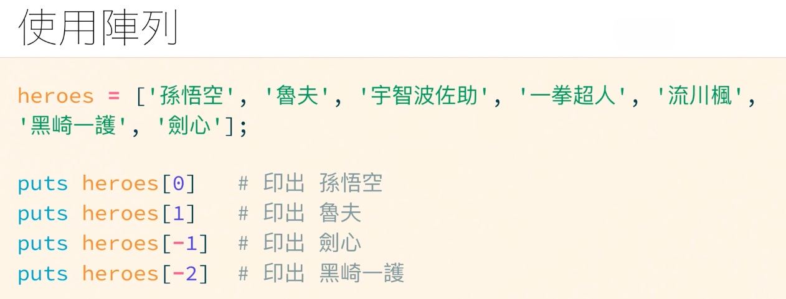
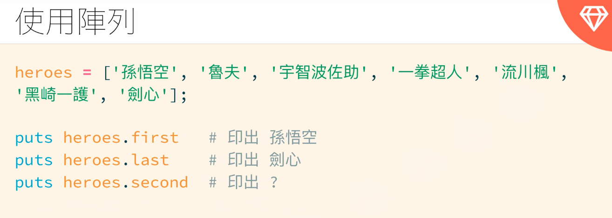

---
# SEO
title: 陣列與範圍
description: 陣列與範圍
# image: 在社交媒体卡片中显示的缩略图
keywords: [陣列與範圍, Ruby]
sidebar_position: 5
---

# 陣列與範圍

陣列就像藥盒一樣，我們可以把資料放在一個集合(藥盒)

## 建立陣列

### 使用 Array 類別

a = Array.new

### 使用中括號(最常用)建立陣列

b = []

```ruby
list = [1,2,3,4,5,"aa"]

p list  #就會印出list陣列

```

### 使用％w(建立陣列) => 只會建立字串型別元素的陣列

```ruby
list = %w(ruby php pythin)

p list  #印出 ["ruby", "php", "python"]
```

> 陣列的索引值一樣從 0 開始




還可以繼續使用一些方法

```ruby
puts heroes.length  # 印出7

heroes << "漩渦鳴人"  # 在最後面加一個人
puts heroes.length   # 印出8

heroes.push('布羅利')  # 在最後面加一個人
puts heroes.length  # 印出9
```

## 陣列其他好用方法

### map

> map <br />
> 對陣列集合的每個元素『進行運算』，並收集成新的集合 <br />
> 同義詞：collect

```ruby
list = [1,2,3,4,5]

p list.map { |x| x*2}   # 印出 [2, 4, 6, 8, 10]
p list.collect { |x| x*2}   # 印出 [2, 4, 6, 8, 10]

p (1..10).map { |x| x * 2} # 印出[2, 4, 6, 8, 10, 12, 14, 16, 18, 20]
```

### select

> select <br />
> 從集合裡挑選符合條件的元素，並搜集成一個新的集合 <br />
> 同義詞：filter <br />
> 反義詞：reject

```ruby
p (1..10).select { |x| x < 5} #印出[1, 2, 3, 4]
p (1..10).filter { |x| x < 5} #印出[1, 2, 3, 4]


p (1..10).reject { |x| x < 5} #印出[5, 6, 7, 8, 9, 10]
```

### reduce

> reduce <br />
> 對集合裡每個元素進行運算，並將所有的運算結果歸納成一個單一結果 <br />
> 同義詞：inject <br />

假設我想要算 1~10 的累加結果

```ruby
p (1..10).reduce { |sum, x| sum + x}  #印出55
```

更多陣列方法可參考https://ruby-doc.org/3.2.2/Array.html

## 陣列方法練習

1.把陣列[1,2,3,4,5] 變成 [1,3,5,7,9]?
試著先自己寫，即使還不知道要用什麼方法，<br />
可以先拆解小步驟：<br />

```ruby
# step 1  ＝> 我要的是新陣列 [1,3,5,7,9]
# step 2  ＝> 舊陣列和新陣列的差異？[1,2,3,4,5] =>  [1,3,5,7,9]
# step 3  ＝> 舊陣列每一個index的元素加上該位置的index就會等於新陣列
# step 4  ＝> 需要使用map以及會有index 得到的結果＝>轉為新陣列

result_array = [1, 2, 3, 4, 5].map.with_index { |a, index| a += index }
p result_array # [1,3,5,7,9]

# 老師解法：
p [1, 2, 3, 4, 5].map { |x| x * 2 - 1} # [1,3,5,7,9]
```

2.把陣列[1,3,4,1,7,nil,7] 由小到大排序，並且移除 nil 以及重複的數字

```ruby
# step 1  ＝> 去掉nil的方法 .compact
# step 2  ＝> 去掉重複的值  .uniq
# step 3  ＝> 由小到大 順序  .sort { |a, b| a <=> b }

p [1,3,4,1,7,nil,7].compact.uniq.sort {|a, b| a <=> b} # 印出[1, 3, 4, 7]

p [1,3,4,1,7,nil,7].compact.uniq.sort {|a, b| b <=> a} # 印出[7, 4, 3, 1]
```

## 範圍 range

:::note

```ruby
puts (1..10).to_a   # 印出 1~10
puts (1...10).to_a   # 印出 1~9 => 沒事不要使用這三點
```

.to_a 是在做轉型，a 就是指=>array

字串也適用：

```ruby
(1..10)   # 範圍 1~10
('a'..'z')  # 範圍 a~z
('A'..'Z')   # 範圍 A~Z
```

:::

ruby 沒有真正的 for 迴圈，若真的想印出可以使用：

```ruby
for i in 1..10
  puts i
end
```

### 練習題：

利用 range 的特性，完成： <br />

1. 印出 1~100 之間所有的『單數』 <br />

```ruby
p (1..100).select {|x| x % 2 == 1}

p (1..100).select {|x| x.odd ?}
```

2. 計算 1 ~ 100 總和 <br />

```ruby
p (1..100).reduce { |sum, x| sum + x}   # 印出5050
p (1..100).sum  # 印出5050
```

3. 印出 5 個小於 100 且不重複的亂數 <br />

```ruby
p (1...100).to_a.shuffle.slice(0,5)
p (1...100).to_a.shuffle.first(5)
p (1...100).to_a.sample(5) # 最好的答案 sample會隨機取樣數 並確保不會重複
```
